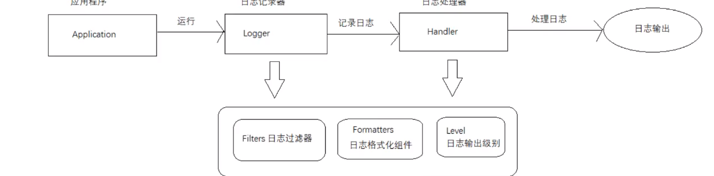

## Logger
Logger被称为记录器，应用程序通过获取Logger对象，使用其API来发布日志信息。Logger通常被认为是访问日志系统的入口程序。
## Handler
处理器，每个Logger都会关联一个或者一组Handler，Logger会将日志交给关联的Handler去做处理，由Handler负责将日志做记录。Handler具体
实现了日志的输出位置，比如可以输出到控制台或者是文件中等等。
## Filter
过滤器，根据需要定制那些信息会被记录，那些信息会被略过
## Formatter
格式化组件，它负责对日志中的数据和信息进行转换和格式化，所以它决定了我们输出日志最终的形式。
## Level
日志的输出级别，每条日志消息都有一个关联的级别。我们根据输出级别的设置，用来展现最终所呈现的日志信息。根据不同的需求去设置不同的级别。

# JUL日志框架使用方式总结(原理解析)
1. 初始化日志管理器(LogManager)
   * LogManager加载logging.properties配置文件
   * 添加Logger到LogManager
2. 从单例的LogManager获取Logger
3. 设置日志的级别Level,在打印的过程中使用到了日志记录的LogRecord类  
4. Filter作为过滤器，提供了日志级别之外更加细粒度的控制
5. Handler日志处理器,决定了日志的输出方式，输出位置，例如控制台，文件
6. Formatter是用来格式化输出的