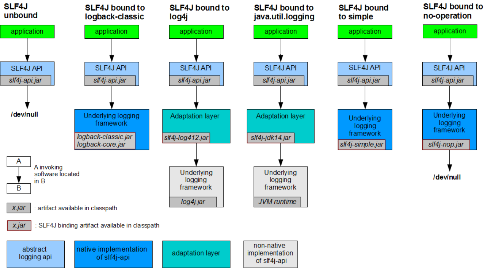

## 门面模式(外观模式)
门面模式属于GoF23中设计模式其中之一
* 核心：
    - 与一个子系统的通信必须通过一个统一的外观对象进行，使得子系统更易于使用
    
## slf4j全称
simple logging facade for java 简单的日志门面

## 集成其他日志框架



SLF4J日志门面，共有3中情况对日志实现进行绑定
1. 在没有绑定任何日志实现的基础之上，日志是不能够绑定实现任何功能的，
值得注意的是，slf4j-simple是slf4j官方提供的
   使用的时候，也是需要导入依赖，自动绑定到slf4j门面上
   如果不导入，slf4j 核心依赖是不提供任何实现的
2. logback和simple(包括nop)
   都是slf4j门面时间线后面提供的日志实现，所以API完全遵循slf4j进行设计
   那么只需要导入想要使用的日志实现依赖，即可与slf4j无缝衔接
   值得一提的是nop虽然也划分到了实现中，但是它是指不实现日志记录
3. log4j和JUL
   都是slf4j门面技术时间线前面的日志实现，所以API不遵循slf4j进行设计
   通过适配桥接的技术，完成了与日志门面的衔接

## 集成其他日志框架之前
```
            测试一：
                在原有slf4j-simple日志实现的基础上，又集成了logback
                通过测试，日志是打印出来了,但是会和simple冲突，还是会使用simple日志实现
                如果先导入logback依赖，后导入slf4j-simple依赖
                那么默认使用的就是logback依赖
                如果有多个日志实现的话，默认使用先导入的实现
            测试二：
                将slf4j-simple注释掉
                只留下logback，那么slf4j门面使用的就是logback日志实现
                在实际应用的时候，一般情况下，只集成一种日志实现框架即可

                通过这个集成测试，发现虽然底层的日志实现改变了，但是源代码完全没有改变
                这就是日志门面的最大有事
                在底层真是记录日志的时候，不需要应用去做任何的了解
                应用只需要记slf4j的API就可以了
```